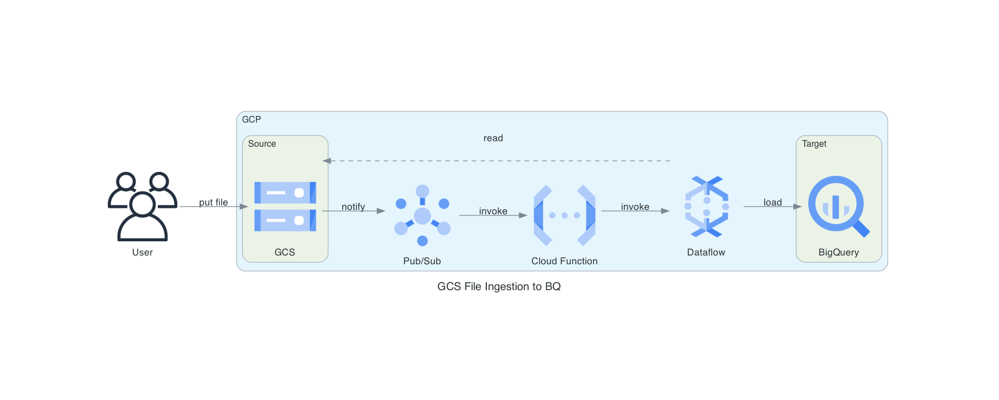

<!-- START doctoc generated TOC please keep comment here to allow auto update -->
<!-- DON'T EDIT THIS SECTION, INSTEAD RE-RUN doctoc TO UPDATE -->
**Table of Contents**  *generated with [DocToc](https://github.com/thlorenz/doctoc)*

- [Summary](#summary)
  - [Used files](#used-files)
  - [TODOS](#todos)
- [Infrastructure](#infrastructure)
  - [Requirements](#requirements)
  - [Providers](#providers)
  - [Modules](#modules)
  - [Resources](#resources)
  - [Inputs](#inputs)
  - [Outputs](#outputs)

<!-- END doctoc generated TOC please keep comment here to allow auto update -->

# Summary

To accomplish the task, I implemented the following architecture in GCP:


1. Data Ingestion:
  Two datasets, were downloaded and uploaded to Google Cloud Storage (GCS):
    - [Yellow Taxi Trip Records](https://www.nyc.gov/site/tlc/about/tlc-trip-record-data.page)
    - [Taxi Zone Lookup Table](https://d37ci6vzurychx.cloudfront.net/misc/taxi_zone_lookup.csv)
1. Pipeline Design:
    - Triggering Event: A Pub/Sub topic was configured to monitor GCS for new file uploads.
    - Processing Logic: A Cloud Function was set up to parse event metadata and trigger a Dataflow job.
    - Data Transformation and Loading: The Dataflow job loaded the processed data into a BigQuery table.
2. SQL Query for Insights:
    - A SQL query was written in BigQuery to calculate the number of taxi trips originating in New York to other cities during a specific week, including weekends.

    ```sql
    SELECT
      EXTRACT(YEAR FROM t.tpep_pickup_datetime) as year,
      EXTRACT(WEEK(MONDAY) FROM t.tpep_pickup_datetime) as week,
      count(*) as c
    FROM `${var.gcp_project}.${google_bigquery_dataset.data.dataset_id}.yellowwtrip` t
    WHERE t.DOLocationID = (
      SELECT LocationID
      FROM `${var.gcp_project}.${google_bigquery_dataset.data.dataset_id}.taxi_zone`
      WHERE Zone = 'Outside of NYC'
    )
    GROUP BY 1, 2
    LIMIT 1000
    ```

## Used files

- [Yellow Taxi Trip Records](https://www.nyc.gov/site/tlc/about/tlc-trip-record-data.page)
- [Taxi Zone Lookup Table](https://d37ci6vzurychx.cloudfront.net/misc/taxi_zone_lookup.csv)

## TODOS

- Move Terraform and gcloud steps in CI to composite actions fo re-usability
- Add CI jobs for tests
- Move building to CI and use dependencies from [pyproject.toml](pyproject.toml)
- General cleanup

# Infrastructure

<!-- BEGIN_TF_DOCS -->
## Requirements

| Name | Version |
|------|---------|
| <a name="requirement_google"></a> [google](#requirement\_google) | 6.12.0 |

## Providers

| Name | Version |
|------|---------|
| <a name="provider_archive"></a> [archive](#provider\_archive) | 2.6.0 |
| <a name="provider_google"></a> [google](#provider\_google) | 6.12.0 |
| <a name="provider_null"></a> [null](#provider\_null) | 3.2.3 |

## Modules

No modules.

## Resources

| Name | Type |
|------|------|
| [google_artifact_registry_repository.dataflow](https://registry.terraform.io/providers/hashicorp/google/6.12.0/docs/resources/artifact_registry_repository) | resource |
| [google_bigquery_dataset.data](https://registry.terraform.io/providers/hashicorp/google/6.12.0/docs/resources/bigquery_dataset) | resource |
| [google_bigquery_job.analysis](https://registry.terraform.io/providers/hashicorp/google/6.12.0/docs/resources/bigquery_job) | resource |
| [google_bigquery_table.analysis](https://registry.terraform.io/providers/hashicorp/google/6.12.0/docs/resources/bigquery_table) | resource |
| [google_cloudfunctions2_function.bq_ingest](https://registry.terraform.io/providers/hashicorp/google/6.12.0/docs/resources/cloudfunctions2_function) | resource |
| [google_project_iam_binding.cf_dataflow_invoker](https://registry.terraform.io/providers/hashicorp/google/6.12.0/docs/resources/project_iam_binding) | resource |
| [google_project_iam_binding.cf_gcs_access](https://registry.terraform.io/providers/hashicorp/google/6.12.0/docs/resources/project_iam_binding) | resource |
| [google_project_iam_binding.cf_sa_user](https://registry.terraform.io/providers/hashicorp/google/6.12.0/docs/resources/project_iam_binding) | resource |
| [google_project_iam_binding.df_gcs_access](https://registry.terraform.io/providers/hashicorp/google/6.12.0/docs/resources/project_iam_binding) | resource |
| [google_project_iam_binding.df_sa_user](https://registry.terraform.io/providers/hashicorp/google/6.12.0/docs/resources/project_iam_binding) | resource |
| [google_project_iam_binding.df_viewer](https://registry.terraform.io/providers/hashicorp/google/6.12.0/docs/resources/project_iam_binding) | resource |
| [google_project_iam_binding.df_worker](https://registry.terraform.io/providers/hashicorp/google/6.12.0/docs/resources/project_iam_binding) | resource |
| [google_pubsub_topic.gcs_put](https://registry.terraform.io/providers/hashicorp/google/6.12.0/docs/resources/pubsub_topic) | resource |
| [google_pubsub_topic_iam_member.topic_publisher](https://registry.terraform.io/providers/hashicorp/google/6.12.0/docs/resources/pubsub_topic_iam_member) | resource |
| [google_service_account.cloud_function_sa](https://registry.terraform.io/providers/hashicorp/google/6.12.0/docs/resources/service_account) | resource |
| [google_service_account.dataflow_sa](https://registry.terraform.io/providers/hashicorp/google/6.12.0/docs/resources/service_account) | resource |
| [google_storage_bucket.artifacts](https://registry.terraform.io/providers/hashicorp/google/6.12.0/docs/resources/storage_bucket) | resource |
| [google_storage_bucket.data](https://registry.terraform.io/providers/hashicorp/google/6.12.0/docs/resources/storage_bucket) | resource |
| [google_storage_bucket_object.cf_artifact](https://registry.terraform.io/providers/hashicorp/google/6.12.0/docs/resources/storage_bucket_object) | resource |
| [google_storage_bucket_object.gcs_to_bq_dataflow_flex_template](https://registry.terraform.io/providers/hashicorp/google/6.12.0/docs/resources/storage_bucket_object) | resource |
| [google_storage_notification.put](https://registry.terraform.io/providers/hashicorp/google/6.12.0/docs/resources/storage_notification) | resource |
| [null_resource.build_and_push_docker](https://registry.terraform.io/providers/hashicorp/null/latest/docs/resources/resource) | resource |
| [archive_file.cf](https://registry.terraform.io/providers/hashicorp/archive/latest/docs/data-sources/file) | data source |
| [google_storage_project_service_account.gcs](https://registry.terraform.io/providers/hashicorp/google/6.12.0/docs/data-sources/storage_project_service_account) | data source |

## Inputs

| Name | Description | Type | Default | Required |
|------|-------------|------|---------|:--------:|
| <a name="input_env"></a> [env](#input\_env) | Environment name | `string` | n/a | yes |
| <a name="input_gcp_project"></a> [gcp\_project](#input\_gcp\_project) | GCP Project ID | `string` | n/a | yes |
| <a name="input_region"></a> [region](#input\_region) | GCP Region for deployment | `string` | n/a | yes |
| <a name="input_service"></a> [service](#input\_service) | Name of the service | `string` | n/a | yes |

## Outputs

No outputs.
<!-- END_TF_DOCS -->
